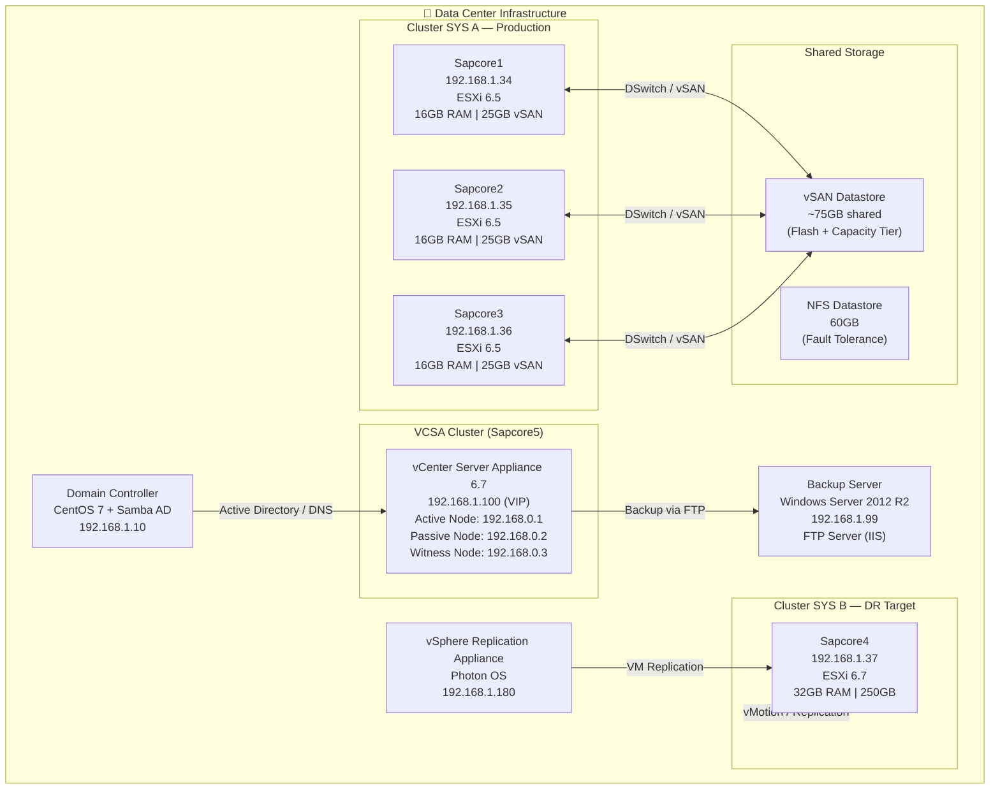
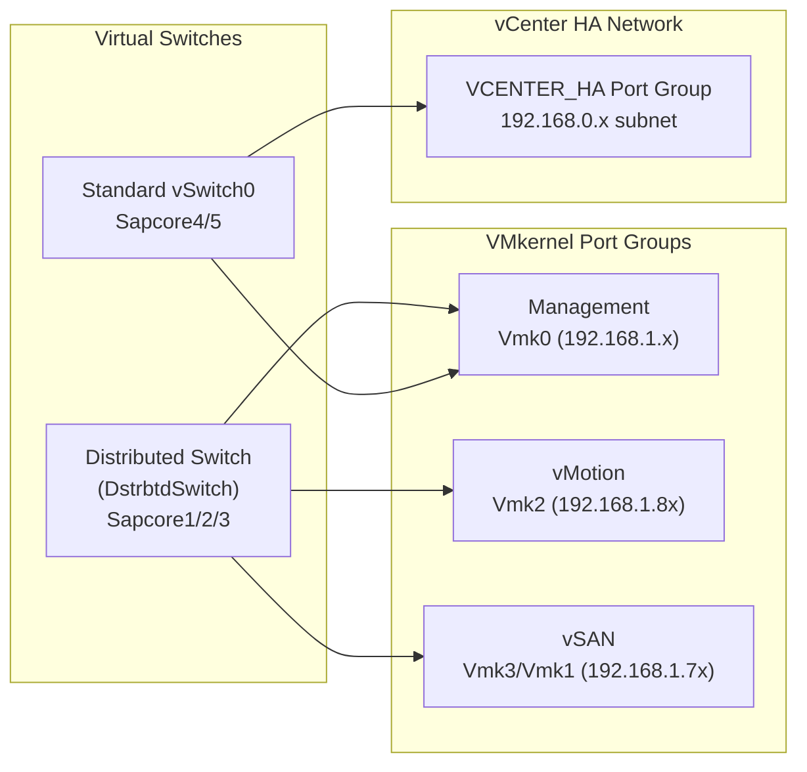

# Network Diagram of Data Center Simulation with Disaster Recovery Capability

> A full Network diagram within a virtualized lab environment.

## 🧩 Component Summary

| Component | Hostname | IP Address | OS / Version | Role |
|-----------|----------|------------|--------------|------|
| Domain Controller | vsystem | 192.168.1.10 | CentOS 7 + Samba 4.6 | AD, DNS |
| vCenter Server Appliance | VCSA | 192.168.1.100 | VCSA 6.7 | vSphere Management |
| ESXi Host 1 | Sapcore1 | 192.168.1.34 | ESXi 6.5 | Production Cluster |
| ESXi Host 2 | Sapcore2 | 192.168.1.35 | ESXi 6.5 | Production Cluster |
| ESXi Host 3 | Sapcore3 | 192.168.1.36 | ESXi 6.5 | Production Cluster |
| ESXi Host 4 | Sapcore4 | 192.168.1.37 | ESXi 6.7 | DR Cluster / Replication Target |
| ESXi Host 5 | Sapcore5 | 192.168.1.28 | ESXi 6.7 | vCenter HA Host |
| Backup Server | BACKUPSRV | 192.168.1.99 | Windows Server 2012 R2 | FTP Backup Target |
| Replication Appliance | Photon-machine | 192.168.1.180 | vSphere Replication 8.0 | VM Replication |

---

---

## 📐 Network Design

| Host | VMkernel | Service | IP Address |
|------|----------|---------|------------|
| Sapcore1 | Vmk0 | Management | 192.168.1.34 |
| Sapcore1 | Vmk2 | vMotion | 192.168.1.80 |
| Sapcore1 | Vmk3 | vSAN | 192.168.1.70 |
| Sapcore2 | Vmk0 | Management | 192.168.1.35 |
| Sapcore2 | Vmk2 | vMotion | 192.168.1.81 |
| Sapcore2 | Vmk3 | vSAN | 192.168.1.71 |
| Sapcore3 | Vmk0 | Management | 192.168.1.36 |
| Sapcore3 | Vmk2 | vMotion | 192.168.1.83 |
| Sapcore3 | Vmk3 | vSAN | 192.168.1.72 |
| Sapcore4 | Vmk0 | Management | 192.168.1.37 |
| Sapcore5 | Vmk0 | Management | 192.168.1.28 |

---
